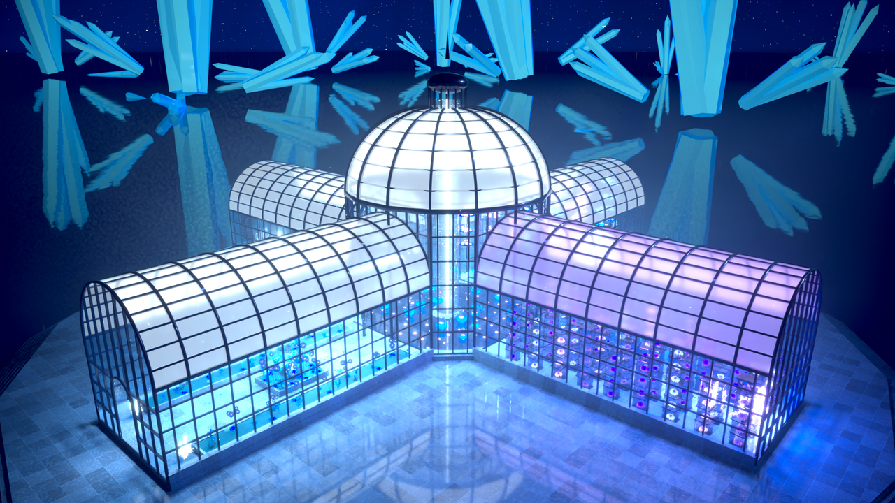

# FractalWorld

以分形数学为骨架的幻想世界。每个**境界**（realm）是一个 Python 包：设计系统 `Realm.json`、几何节点资产库 `Kit/`、
场景 `Scenes/<场景>/`。所有几何都由 GN 资产生成，场景只是数据（`scene.json`）；渲染时从不采样参考图、没有任何投影贴图，
任何机位看到的都是同一个 3D 世界，粒子与水波都随场景时钟运动，拖动时间轴即可播放。

当前内容：

* **水晶幻想（CrystalFantasy）· 水晶温室（Conservatory）**：漂浮在星海中的维多利亚式玻璃温室——光之柱与倒影池、
  悬挂的盆景与水晶、玻璃展柜塔里的紫色大丽花、层层垂挂的蓝水浅碗、银河宝珠花园、玻璃多层架上的宝石。
  详见 [`CrystalFantasy/Scenes/Conservatory/README.md`](CrystalFantasy/Scenes/Conservatory/README.md)。

  

## 构建与渲染

在 **Blender 5.3** 上开发与验证（更早的版本没有测试过）。与 `BlueArchive/build.py` 共用同一套 `Core.driver`，用法相同：

```bash
# 构建并保存 Build/CrystalFantasy/Conservatory/Conservatory.blend（含全部英雄机位、自由机位与巡游镜头）
blender -b -P FractalWorld/build.py

# 渲染某个英雄机位 / 自由机位
blender -b -P FractalWorld/build.py -- --shot VitrineGallery --render gallery.png
blender -b -P FractalWorld/build.py -- --view overlook --render overlook.png

# 渲染巡游视频（可随时中断，重跑接着渲）
blender -b -P FractalWorld/build.py -- --render-animation
```

在 Blender 界面里：Scripting 工作区 → Text → Open `FractalWorld/build.py` → Run Script。构建完成后，
英雄机位是 `CAM_<镜头>`、自由机位是 `VIEW_<名字>`，任意切换或自己加相机都行；按空格播放可以看到蝴蝶、光尘、落花、
漂浮的山茶、水波与轻轻摆动的吊饰。

## 目录结构

```
FractalWorld/
  build.py                 入口：境界 → 场景 → 镜头（Core.driver）
  Fractals/                各境界共享的分形数学
    phyllotaxis.py         黄金角点阵（3D 斐波那契）：球冠等面积 z = 1 − t(1 − cos θ)、Vogel 圆盘/圆环
    recursion.py           自相似：迭代函数系统按层展开（第 k 层 = 种子 ∪ 子框架上的第 k−1 层）
    cosmos.py              星空虚空：两层 Voronoi 星点、星云带、地平线辉光
  CrystalFantasy/          水晶幻想
    Realm.json             色板、花型预设、器皿轮廓、宝石切工、蝴蝶翅形
    values.py              数据 → 插口值（角度写度数，颜色可写色板名）
    scenes.py              scene.json 解释器：放置模式 at/ring/grid/line/sunflower、逐件变化 vary、悬挂摆动 sway、灯
    Kit/                   GN 资产库（CF.*）与材质库
      crystals.py          石英、晶簇（自相似）、吊坠、明亮式切工宝石、葡萄状晶珊瑚（球花分形）
      flora.py             斐波那契花（大丽花/山茶/玫瑰/睡莲/小花）、绣球（花中之花）、L 系统植物、宝珠植物
      vessels.py           药剂罐、悬挂玻璃球、浅碗与等比垂挂链、玻璃高脚盘、银河宝珠
      displays.py          玻璃展柜塔、等比多层玻璃架、沃德箱
      architecture.py      玻璃山墙（任意拱形轮廓与拱门，窗格用布尔裁切）、中殿、圆厅、铁环、花坛、光之柱
      particles.py         蝴蝶、光尘、落花、漂花（场景时钟的闭式函数，无需烘焙）
      environment.py       晶塔、海面、光雾、石台
      materials.py         材质库（玻璃/水晶/水为真折射介质，阴影光线按色透明）
    Scenes/Conservatory/   水晶温室（scene.json、镜头、巡游动画、渲染结果）
```

## 分形与数学

| 母题 | 算法 |
|------|------|
| 花瓣、花心、叶序、晶芽、漂花 | 黄金角 π(3 − √5) 发散角；球冠等面积高度、Vogel 圆盘 r = R√t；花瓣倾角与大小沿螺旋参数 t 渐变 |
| 绣球 | 两级斐波那契：花球的圆顶点阵上，每一点是一朵四瓣小花 |
| 晶簇 | 自相似迭代函数系统：一簇石英的根部长出整簇的缩小副本，最多两层 |
| 晶珊瑚 | 球花分形（sphereflake）：球面黄金角点阵上生出缩小的球，逐代递归 |
| 植物 | L 系统：弯曲渐细的茎，叶按黄金角螺旋排列，侧枝是整株的缩小副本（两代） |
| 垂挂浅碗、多层玻璃架 | 等比数列：每一层比上一层小 `Ratio`，间距按同一比例收缩 |
| 银河宝珠 | 对数螺旋旋臂 θ = θ₀ + ln(r/r₀)·cot(ψ)，核心更密更暖，随场景时钟自转 |
| 晶塔 | 等面积黄金角圆环上的巨型晶簇 |
| 星空 | 三维 Voronoi 胞元上的星点（亮度按幂次分布）与分形噪声星云带 |
