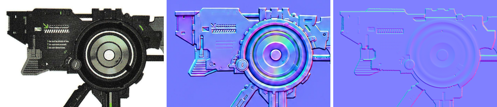
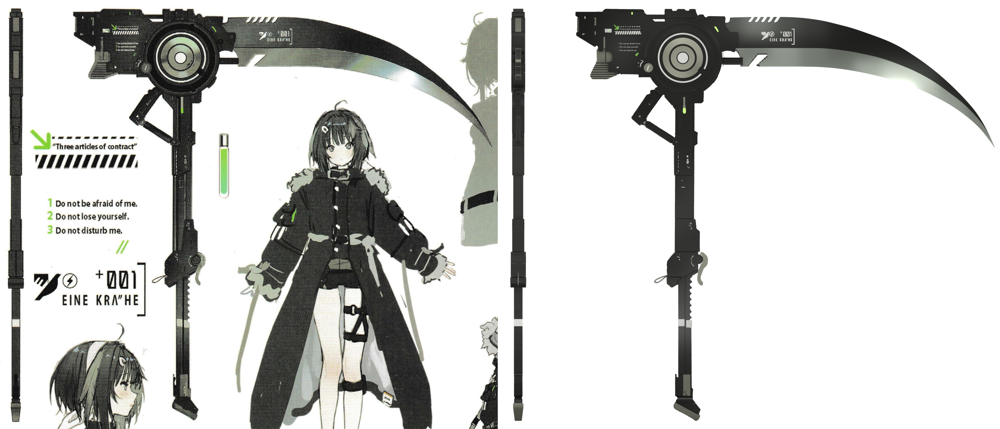
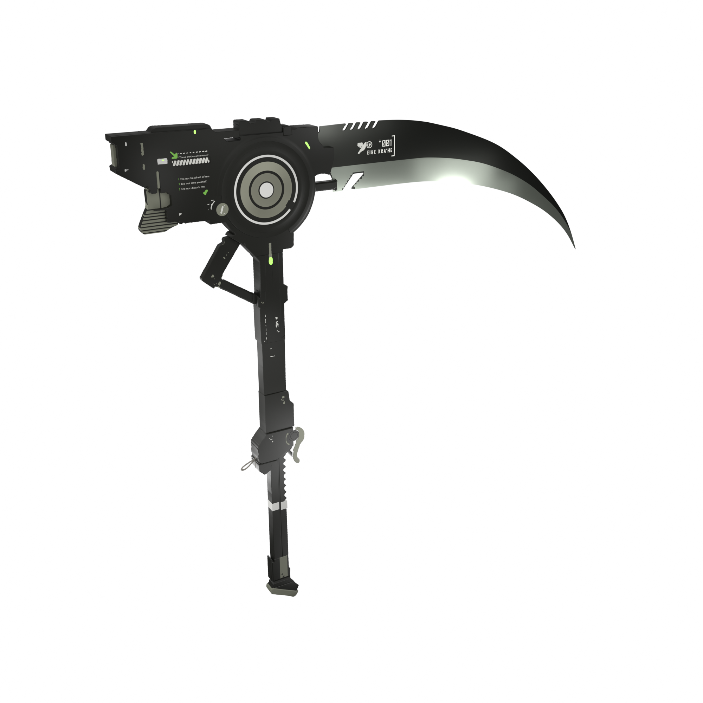
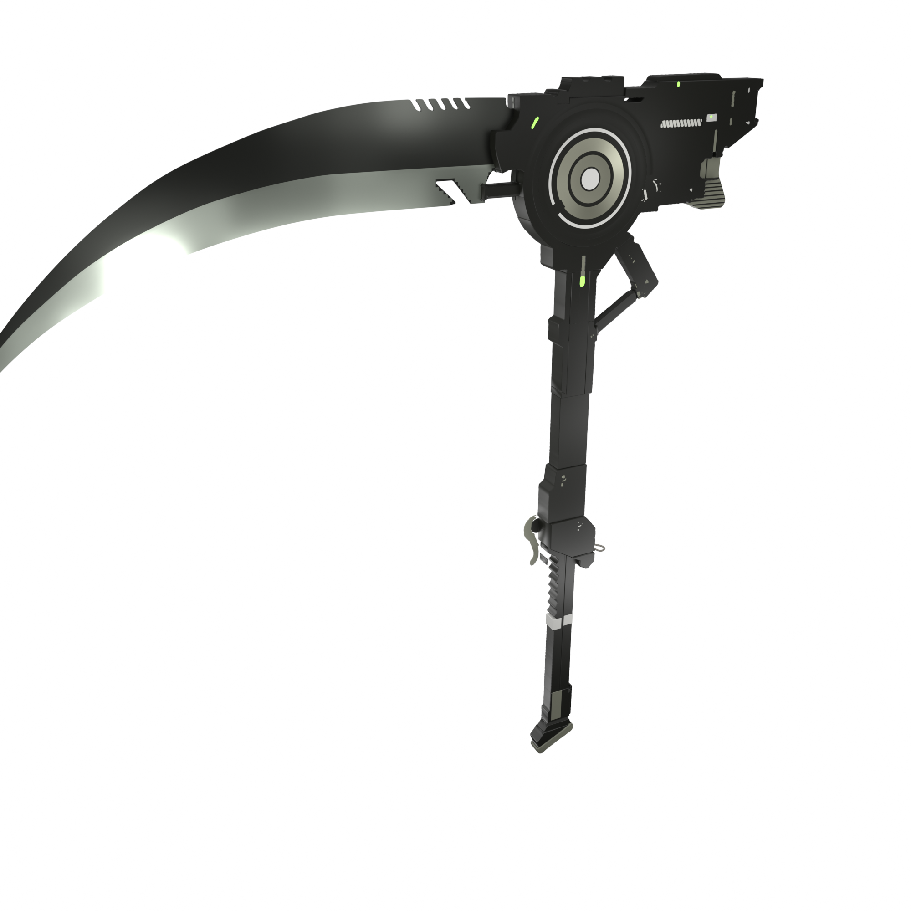
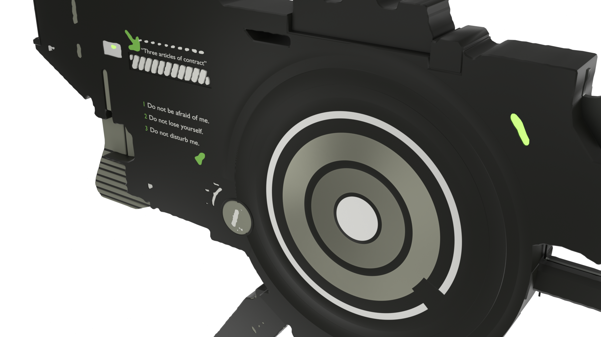
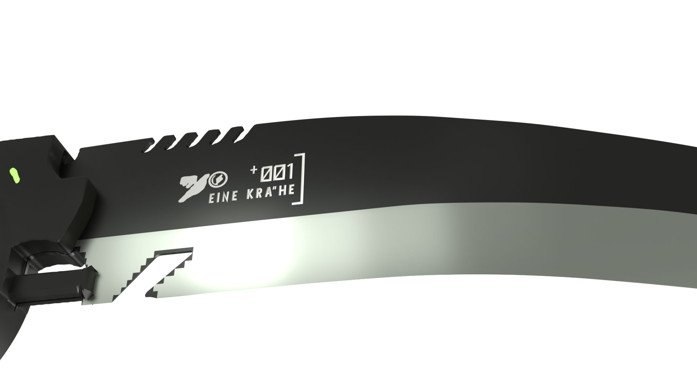
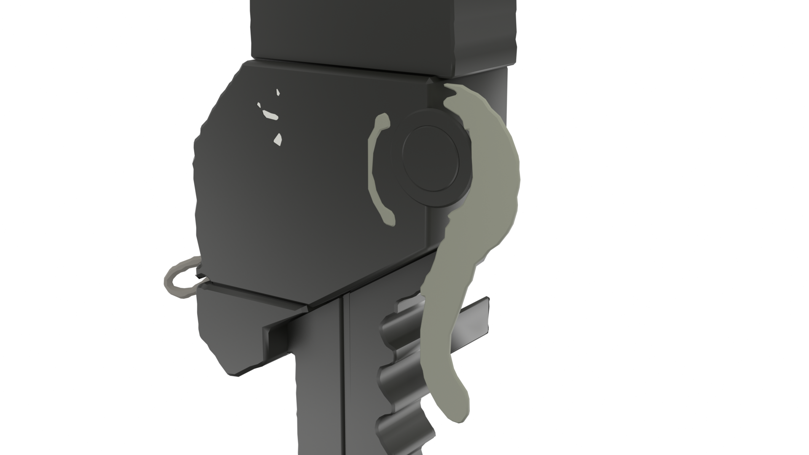
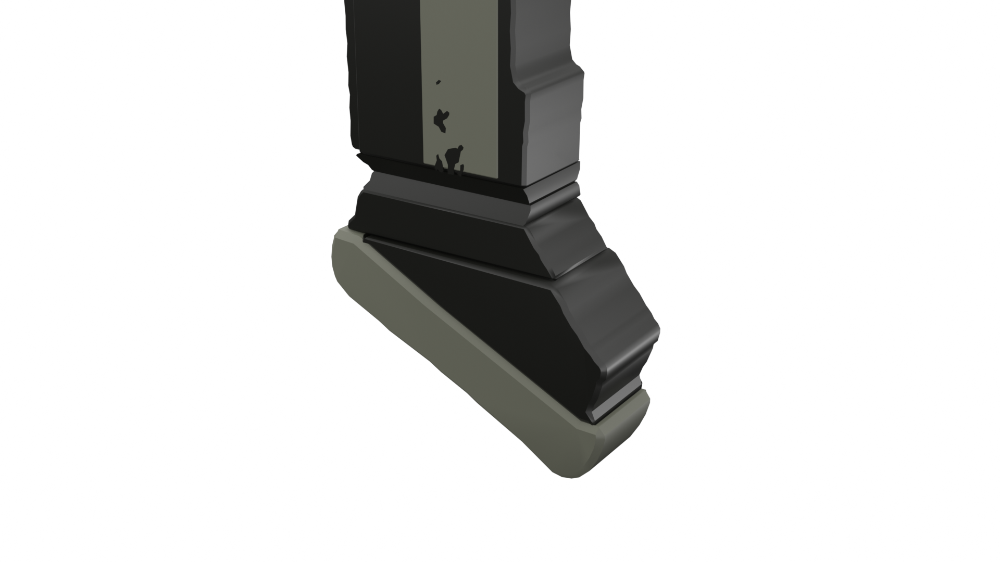

# Scythe：设定集镰刀

参考：`Reference/Sheet.jpg`（2741 × 2539，设定集的一页扫描：镰刀的侧视图、左边细长的端视图，以及人物与说明文字）。
人物、说明文字不在还原范围内。渲染：`Renders/Sheet.png`（设定图机位，与扫描件逐像素同一网格）、`Renders/End.png`
（端视图机位）、`Renders/view_*.png`（自由机位）。

```bash
blender -b -P Other/build.py -- Weapons/Scythe                                   # 构建并保存 Build/Weapons/Scythe/Scythe.blend
blender -b -P Other/build.py -- Weapons/Scythe --render sheet.png                # 设定图机位
blender -b -P Other/build.py -- Weapons/Scythe --shot End --render end.png       # 端视图机位
blender -b -P Other/build.py -- Weapons/Scythe --view hero --render hero.png     # 自由机位
```

全部几何都来自 `Weapons/Kit` 的几何节点资产，镰刀只是数据：`weapon.json`（部件、灯光、机位）和 `trace.json`（在设定图上
描出的轮廓）。参考图只用来描轮廓、量厚度、拟合灯光与材质，渲染时从不采样参考图，没有任何投影贴图；`.blend` 里的镰刀是
完整的立体，任意换机位看到的都是同一把镰刀。

## 1. 机位与尺度

设定图是正交的工程视图：侧视图和端视图共用同一条竖直标尺（端视图的上下端与侧视图差 8 px 以内）。所以设定图机位是一台
正交相机，画面就是扫描件本身：1 px = 0.75 mm，原点在转子中心（设定图像素 (1019.48, 463.69)，由转子轮毂圆拟合，残差
0.21 px），+X 向右、+Z 向上、+Y 朝纸里。这个尺度下镰刀高 1.70 m、刃长 1.10 m、柄宽 8 cm、机头厚 5.6 cm——比持握它的
人物略高，是这类大镰刀的常见比例。

数据里一切长度都写设定图像素（`weapon.json` 的 `sheet`：原点像素与每像素的米数），场景解释器换算成米；部件的厚度、
倒角、字高都按像素写，和量出来的数一一对应。

## 2. 轮廓（`calibration/trace.py`）

每个部件是在设定图上描出的一组闭合轮廓，长出厚度（`WPN.Plate`）。描轮廓不靠手点：`calibration/regions.json` 给每个部件
一个圈住它的多边形和它在图上的灰度范围（暗部件 0–147，即它的灰度与纸白的一半处），扫描件先按 1.3 px 高斯模糊化开印刷网点，
轮廓取「灰度离开范围」与「多边形边界」两者先到的零等值线——沿着纸白它贴住画出的边缘到亚像素，切过部件内部时沿多边形走。
细碎的网点噪声（小于 `min_area`）丢掉，其余简化到 0.3 px 以内。浅色对浅色的边（刃上的槽口对磨面、鞋底的下沿）两边灰度
只差一百上下，网点的起伏会让阈值线抖成台阶，这类区域放宽模糊（`sigma`）与简化（`simplify`）。

* **相邻部件**共用一条边：`minus` 从一个部件里扣掉另一个已描好的轮廓，`within` 只留另一个轮廓之内的部分（画在部件上的标记
  不会溢到纸上）。
* **通孔**（纸白从部件里透出来的地方）是部件轮廓的内环：转子开口、机头上方的细长槽、刃根的槽口与缺口。
* **印得没有边的部件**按量出的尺寸写多边形：下颚的八道横槽（逐列灰度谷底定行，裁到下颚轮廓之内；横肋是下颚轮廓减去它们）、
  下段导轨上的白箍（左右两半错开 6 px，右端和纸白连成一片）、刃根下的切口、白色斜纹所在的矩形凹槽（法线图上槽壁的位置）。
* **刃根的斜槽**是浅色对浅色，网点让描出的边抖出折角；它是机加工的直边槽，所以两条边逐行在槽与刃的一半灰度处取点、直线拟合
  （残差 1.1 px、0.3 px，左边剔掉两团网点），顶边取一半灰度处的行，两个顶角按画出的圆角倒圆（12 px、3.2 px）。
* **刃**是三条长曲线（刃背、开刃线、刃口），按列搜索：每一列在给定上下界里找这条边（刃背是纸到刃的第一道阶，刃口是刃到纸的
  最后一道阶，开刃线是黑色刃面到亮色磨面最陡的一道阶），再用平滑样条拟合（三倍均方根以外的列当离群剔掉，重拟两轮），
  跨过槽口、字与磨面上那块印成纸白的高光。刃尖画在另一个人影上、灰度分不出，手量了十一个点钉住。三条线的拟合残差：刃背 0.45 px、开刃线 0.61 px、刃口 0.43 px（均方根）。
* **字**：机头上的说明文字字形清楚，用内置字体排版，按量出的墨迹盒对齐宽度（`WPN.Lettering`）；刃上的「EINE KRA"HE」
  与「ØØ1」印得太小，网点糊成一片，按量出的每个笔画的墨迹盒写出笔画中线（`WPN.Strokes`），是设定图那种窄体方头的字。

## 3. 厚度（端视图）

左边的细长条是镰刀的端视图（从机头后方看过去），每一高度的宽度就是那里的厚度。宽度和侧视图的轮廓用同一个规则量：
两边都按 1.3 px 模糊，边在部件与纸白的一半灰度处（暗部件取 150）；先前按 200 的灰度量会量到边缘模糊的外沿，每一段都厚出
2–4 px。渲染出的端视图（`End` 机位）按同样的规则逐行量，和设定图逐段对比（中位数，px）。带倒角的板在一半灰度处量出来比它的厚度窄约 0.3 px，
量出的厚度已经按这一点放过：

| 高度（侧视图 v） | 设定图 | 渲染 | 部件（半厚，px） |
|---|---|---|---|
| 186–214 | 53.8 | 54.2 | 机头顶板 `Deck`、顶轨 ±27.35 |
| 214–245 | 69.3 | 70.2 | 机头主体 ±35.25 |
| 245–670 | 75.0 | 74.8 | 后盖、转子冠 ±37.65（其中 v 248–322、430–572 各有一扇浅灰窗：后端板 ±16.45、下颚 ±15.3）；小表盘那几行 ±37.95 |
| 676–872 | 67.1 | 66.8 | 转子座、柄左侧轨 ±33.6 |
| 877–1100 | 64.9 | 64.9 | 柄下段左轨 ±32.7 |
| 1100–1338 | 53.6 | 53.6 | 管 ±27.1 |
| 1338–1517 | 64.2 | 65.2 | 夹座 ±32.85 |
| 1517–1655 | 81.6 | 81.7 | 握把 ±40.7（左右两半，中线一道合缝），拨杆与旋钮的外面在 41.7 |
| 1655–1712 | 85.5 | 85.7 | 握把底座 ±43.2 |
| 1712–2180 | 46.3 | 46.3 | 下段导轨 ±23.5 |
| 2184–2300 | 45.8 | 45.8 | 套 ±23.2，导轨在它底下收到 ±22.7 |
| 2302–2318 | 41.2（最窄 37.7） | 41.5（最窄 38.4） | 脚颈：上下两半各自收窄，在 v 2310 收到 ±18.8 |
| 2318–2340 | 46.3 | 44.7 | 脚 ±22.65（端视图的脚上沿有一道 4 行宽的棱，±23.5） |
| 2340–2445 | 47.3 | 48.8 | 鞋底 ±28.05（圆边 3）、鞋跟 ±26.6，从 v 2364 起向下线性收窄到 0.68（`Taper`）；差在最宽的几行是浅灰的鞋底，浅色部件的边比暗部件的一半灰度更亮，按 150 量会量窄 |

## 4. 设定图里"反 3D"的地方与处理

原则：**3D 里是合理、可以自由换机位的结构；在设定图机位下贴合设定图**，不为了贴合去扭曲几何。

| 设定图现象 | 处理 |
|----------|------|
| 端视图是手画的，特征和侧视图差几到二十几像素（例如转子外圈在端视图里上下各长出 20–28 px） | 高度一律取侧视图，只从端视图取厚度 |
| 端视图的柄在 v 874 处收窄（±33.5 → ±32.4），侧视图那一高度看不出边 | 柄左侧轨止于 874，其下是 ±32.7 的下段左轨（`Lower Rail`，刻度点画在它上面）；面板也止于 874 |
| 脚颈在端视图里是一道 V 形窄腰（±23 收到 ±18.8 再回到 ±23） | 脚颈是上下两半（`Collar`、`Collar Lower`），各自从外沿的满厚线性收到正中的 ±18.8；收窄从哪一高度起，板就在那一高度切出一圈棱，面的倾折落在棱上而不是被三角面抹开 |
| 下段导轨底下那块浅灰的套（v 2184–2300）画在导轨前面，端视图在那一段却比导轨窄 0.5 px | 导轨在套的上沿处收一级（`Rail Left Foot`、`Rail Right Foot` ±22.7），套 ±23.2 包在外面 |
| 小表盘压在转子冠上（设定图里画在冠的前面），端视图那几行却没有凸起 | 表盘面高过冠顶 0.3（±37.95），端视图在那 55 行宽出 0.9 px |
| 握把上的拨杆和旋钮画在握把侧面，端视图里却没有任何凸起 | 握把主体 ±40.7，拨杆与旋钮嵌进握把面、只凸出 1，端视图宽 82 |
| 机头上方一条纸白的细槽 | 贯通的槽（机头轮廓的内环），不是白漆 |
| 刃上的小字印成一团网点 | 按墨迹盒量出每个笔画，写成笔画中线 |
| 端视图的鞋跟上宽下窄 | 鞋跟与鞋底的厚度向下线性收窄到三分之二 |
| 旋钮周围的亮环与拨杆是同一个零件的颜色 | 拨杆带着环（轮廓里的 C 形），旋钮嵌在环里 |
| 机头后端在 v 248–322 凹进 8 px，凹处是一条浅灰；端视图同一高度是一扇 33 宽的浅灰窗 | 后端板：一块 ±16.45 厚的浅灰件嵌在机头后端的凹口里，侧面看是那条浅灰，后面看是那扇窗 |
| 端视图里下颚那一段也有一扇 31 宽的浅灰窗 | 下颚（带横肋的浅灰块）厚 ±15.3，窗就是它的后端面，两侧是更厚的机身 |
| 转子冠外还有一道外环（半径 187–214），右下方露在纸上、夹在刃座和转子座之间，其余处叠在机身上 | 转子的外裙（`Rotor Collar`、`Rotor Skirt`）：从冠顶斜落到机身面，转过 −62° 到 180°，避开下方的转子座与左下的小表盘 |

## 5. 凹凸：从法线图读出（`calibration/relief.py`）

设定图只给明暗，哪里凸、哪里凹要读出来。`Reference/Normals.png` 是照设定图画出的一张法线图（AI 生成，1254 px 见方）。它不是
测量：刃尖偏开，个别边缘带一圈软晕，平面的颜色在整张图上漂移到满倾斜的四分之一，画了设定图上没有的细节（转子外缘一圈齿），
每一级台阶都画成同样的倒角。但它带着凹凸的方向——倒角总在高的一侧、朝着低的一侧，旋压面朝它倾斜的方向偏——所以只在局部读它的
符号与形状，高度仍然来自端视图与设定图。

* **对齐**：先用仿射把它的剪影（与角落背景色不同的部分）贴到镰刀的剪影上（模糊剪影的 ECC，由粗到细，刃尖不计），再用一张平滑
  的位移场把它的边贴到设定图的边上：沿镰刀逐块用归一化互相关匹配两边的边缘强度，每块按相关峰在各方向上的尖锐程度加权（只有
  一条直边的块只管垂直于这条边的方向），在 48 px 网格上解一张像膜又像板一样少弯的位移场，搜索范围一轮轮收窄，离场太远的块丢掉。
  仿射比例 1.988，位移场中位数 6 px、95% 分位 13 px。
* **约定**：红色随面朝右增大、绿色随面朝上增大（OpenGL）——剪影一圈每个面都朝外，两者和朝外方向的相关是 +0.59、+0.61。
* **台阶**：两个部件在设定图上相邻处，取跨边界方向的倾斜在边界两侧 6 px 内的平均，减去再远一些（9–16 px）的平面上的同一量，
  为正说明前一个部件高；和模型自己在那里的高差逐条对照。



左：设定图；中：对齐到设定图上的法线图；右：模型自己的起伏按法线图的画法画出来（高度模糊 1.5 px，台阶变成倒角）。

据此改正的凹凸（长度都是设定图像素）：

| 部位 | 原来 | 法线图 | 现在 |
|------|------|--------|------|
| 下颚横槽 | 槽是凸出的暗条 | 横肋凸、槽凹 | 横肋 ±15.3，槽底（下颚整块）±13.9 |
| 窗、侧灯槽、后端白槽、▶ 记号、表盘刻度 | 贴在面上、凸出 0.6 | 四壁朝里的凹槽 | 机身两面 2.4 深的凹槽（`Pockets From`、`Pocket Depth`），玻璃、灯、漆在槽底下 1.8 处 |
| 白色斜纹 | 凸出的漆条 | 矩形凹槽里凸起的斜肋 | 2.4 深的矩形槽，斜肋顶面比机身面低 0.25 |
| 表盘指针 | 凸出的漆 | 盘面上一道刻槽 | 1.0 深的刻槽，槽底白漆 |
| 连杆、握把上的记号 | 凸出 0.6 | 刻进去 | 1.0 深的刻槽 |
| 柄右侧 | 一条比框高的侧轨 | 面板右边向下一级 | 右侧带 ±30.4，比框低 0.85、比面板低 2.25，从转子座一直到管 |
| 转子 | 一级级平台、两片缓锥、一道深槽 | 起伏的旋压面 | 见下表 |
| 印刷的字、箭头、短划、刻度点 | 凸出 0.5–0.6 | 平的 | 漆厚 0.15 |
| 下颚上方的浅灰竖杆 | ±19，被机身整个盖住 | 机身面上一道圆头竖槽，杆躺在槽里 | 2.4 深的圆头槽，杆面比机身面低 0.8（量出的圆头条：宽 9.4，圆头心在 v 354.2） |
| 下连杆的销 | ±16，被柄盖住 | 柄面上一个销头 | 销头在下段左轨面上，凸出 0.3（连杆的耳朵插在柄里，被柄面盖住） |
| 下段导轨底下的套 | ±23，在导轨后面、只从两轨的缝里露出一条 | 在导轨前面 | 套 ±23.2，导轨在它底下收到 ±22.7（端视图那一段比导轨窄 0.5 px） |
| 下段导轨的白箍 | 凸出 0.5 | （端视图在那里不变宽） | 漆厚 0.15 |
| 鞋跟与鞋底 | 几乎齐平 | 鞋底的上沿压过鞋跟 | 鞋底 ±28.05、圆边 3，鞋跟 ±26.6 收在鞋底里 |
| 刃座上方的凸块 | ±30，低于机身 | 比机身高 | 与机身齐平 ±35.25（端视图在那一高度只有 ±35.25） |

转子：沿半径一圈圈地把倾斜分成背离圆心的一份、绕着圆心的一份和整圈共有的一份（平面颜色的漂移），只用转子上下没有别的零件压着
的扇区（`relief.ROTOR["excluded"]`：右上的刃座、左边的小表盘、右下的连杆，以及冠以外的转子座）。背离圆心的那份由外往里积分就是
旋压面的剖面，比例由两个高度定：冠顶是端视图量到的满厚 37.65，剖面外端落在机身面 35.25（法线图的坡度乘 0.233）。每一段用
`WPN.Ring` 的 `Rise`（两端的高差）与 `Bulge`（中点在直线以上的量）拟合：

| 半径 | 部件 | 离中面的高度 | 形状 |
|---|---|---|---|
| 0–28.9 | `Hub` | 34.9 | 平 |
| 28.9–33.8 | `Hub Rim` | 34.9 → 33.9 | 一级下坡 |
| 33.8–65.4 | `Rotor Face Inner` | 33.9 → 36.0 | 碗，越往外越陡 |
| 65.4–75.6 | `Rotor Ridge` | 36.0 → 36.75 → 36.65 | 脊，顶在 r 73 |
| 75.6–109.5 | `Rotor Face Outer` | 36.65 → 36.0 | 缓锥 |
| 109.5–126.9 | `Rotor Channel` | 36.0 → 35.8 | 平台，外沿落进白环 |
| 126.9–135.7 | `Rotor Ring` | 35.8 → 35.75 → 36.15 | 谷 |
| 135.7–152 | `Rotor Lip` | 36.15 → 36.9 → 36.6 | 脊，顶在 r 147 |
| 152–167 | `Rotor Bezel` | 36.6 → 35.25 | 下坡进槽 |
| 167–187 | `Rotor Rim` | 35.25 → 37.65 | 上坡到冠顶 |
| 187–214 | `Rotor Collar`、`Rotor Skirt` | 37.65 → 35.4 | 先缓后陡，落到机身面 |

机身中间的孔因此从半径 150 放大到 176：槽底低于机身面，孔小了机身面会盖住它；176 处冠已经高出机身面。

没有采用的：转子外缘的齿、连杆上的长凹槽与刃座上的"R"形支架（设定图里都没有）；脚颈"凸起"（端视图在那里是 V 形窄腰）。
`relief.py` 现在还标出八处分歧：三处是贴着一面竖墙的坡被读成墙另一侧高（冠的内坡挨着转子座与机身、斜肋离槽壁只有 2.5 px），
一处是端视图量死了的脚颈，其余四处在旋钮一圈、撑杆根部与转子座边上，都只有 30–100 px，法线图在那里画得含糊。

## 6. 外观：灯光与材质（`calibration/fit_studio.py`）

设定图的明暗是画家的打光：机头的暗灰在中间偏亮、刃的黑面从刃根到刃尖渐暗、磨面在正对灯的地方一片亮白。要在一块平板上
做出一掌宽内就变化的明暗，灯必须离得近——所以影棚是镰刀前 24 cm 处一面 11 cm 见方的小柔光箱墙（只试够得着镰刀的那些），
上方一排顶灯，机头后方一列照亮端视图看到的后端面；墙和顶灯的每只箱子在镰刀背后都有一只镜像的孪生箱（镰刀两面相同，
从背后看也打着一样的光）。拟合求每只箱子的亮度（漫射与高光分开，即灯的 diffuse / specular 系数）、世界的亮度，以及每种
表面处理的颜色（`Weapons.json` 的 `finishes`：颜色、粗糙度、金属度；拟合出的颜色写进 `weapon.json` 的 `materials`）。

光是线性叠加的：每只箱子在 1 W 下各渲两张（只有漫射 / 只有高光）、世界在强度 1 下渲一张，全部线性 EXR，设定图的两个机位
（侧视图、端视图）各一套；一张平涂的材质色分出每个像素属于哪种表面处理。在两个视图里镰刀的像素上（刃尖画在人影上，排除），
把渲染经 sRGB 编码后对到设定图：表面处理的颜色按通道缩放它漫射的光（金属还缩放它反射的光），不超过白色；发光的绿灯、
样本太少的表面处理不拟合颜色。功率与颜色交替各解一次线性最小二乘（按 sRGB 编码在设定图那个值处的斜率加权，等于在显示值上
拟合），再在真实的编码上一起精修。

线性叠加要在渲染里真的成立，有四件事：

* **纸不是场景的一部分**。EEVEE 的屏幕空间光照与反射会把镜头看到的背景当作光——若世界对相机射线显示白纸，镰刀四周一圈纸白
  会把它照亮。所以镜头渲染透明底片，在合成器里铺到纸上（`look.backdrop`）；世界只有影棚的柔和渐变。
* **弱灯也要照得到**。EEVEE 按每盏灯的功率与 `light_threshold`（默认 0.01）截断它的照射范围，0.04 W 的箱子在 24 cm 外就
  完全不亮了，而拟合用的基底是 1 W 渲的。镜头数据里 `render.eevee.light_threshold` = 10⁻⁶。
* **阴影页不溢出**。几百只带阴影的箱子会把阴影缓冲撑满、丢掉阴影；柔光箱的影子本来就软，阴影贴图精度降到 1/4
  （`shadow_resolution`）。
* **正交机位的深度精度**。正交相机的深度是线性的，默认 0.05–20000 m 的裁剪范围里一个深度台阶约 1 mm，凸出 0.2 mm 的
  凹槽、贴花会被底下的面吃掉；镜头数据把 `camera.clip` 收紧到镰刀前后。

## 7. 与设定图的定量对比（`calibration/check.py`）



左：设定图；右：两台机位的渲染叠在同一张纸上（侧视图 `Sheet` 与端视图 `End`，同一像素网格）。

| 指标 | 值 |
|------|----|
| 轮廓重合（交并比） | 0.986 |
| 轮廓到轮廓的距离（每个轮廓像素到另一边最近的轮廓像素） | 均值 1.17 px，95% 分位 4.0 px |
| 色调误差（两边都按 2 px 高斯模糊化开网点，镰刀像素的平均绝对差，0–255） | 12.8 |
| 　按部位 | 机头 14.7、刃 10.2、支撑 10.4、柄 11.8、握把 13.8、下段导轨 15.4、脚 18.1 |
| 影棚拟合的残差（两个机位的 23299 个采样像素，sRGB） | 平均 11.0 / 255（182 只柔光箱，世界亮度 0.349） |
| 刃的三条曲线（样条到逐列找到的边） | 刃背 0.45 px、开刃线 0.61 px、刃口 0.43 px（均方根） |
| 端视图厚度（逐段中位数，见第 3 节） | 除脚与鞋跟两段（第 3 节）外都在 ±1 px 以内 |
| 凹凸（法线图，见第 5 节） | 149 条部件边界里，法线图明确抬高另一侧的还剩 8 条：三处是贴着竖墙的坡，一处是端视图量死的脚颈，四处是法线图画得含糊的小边 |
| 标定历程（色调误差） | 白纸世界照亮镰刀、基底灯重名 31 → 透明底片铺纸 30 → 基底按真 1 W 重渲、弱灯不再被截断 14.4 → 阴影页不溢出 14.3 → 正交机位收紧裁剪（凹槽、贴花不再被吃掉）、两个机位一起拟合、磨面加糙 13.7 → 补上转子外环与楔块、白箍、拨杆外环 13.1 → 端视图厚度按一半灰度重量 13.2 → 凹凸按法线图改正、外裙补上右下露在纸上的外环、刃根斜槽改直边、被盖住的套与销与竖杆露出来 12.8 |

轮廓的量法：设定图上的镰刀是比部件与纸白的一半灰度更暗的地方，加上比边缘过渡带更宽的浅色部件，加上围在里面、不是纸白的浅色
区域（白漆与磨面印着网点，到不了纸白；槽孔里透出的纸最亮的四分之一到得了）。刃磨面中段那块高光印得和纸一样白，那里的刃口
读不出来，不计入（`check.GLARE`）。

剩余差异：画家的笔触——边棱上一笔笔提亮的高光、导轨上浅色的竖条、磨面上青绿的反光——是在平涂的灰上画出来的，影棚的柔光箱
只能给出光滑的明暗；转子盘面上随角度明暗变化的金属反光与毂盖的纸白也是画上去的（盘面平均差 2，逐个方向差到 40）；鞋跟与鞋底的
灰阶层次；端视图的手绘误差（第 3 节）。

## 8. 自由机位

`weapon.json` 的 `views`（米，原点在转子中心）：`hero`（左前上方的四分之三视角）、`back`（背面：镰刀两面相同，影棚的
每只柔光箱在背后都有孪生箱）、`head`（机头特写）、`blade`（刃根仰看）、`grip`（握把与拨杆）、`foot`（脚）；
以及设定图的两个机位 `Sheet`、`End`（`--shot End`）。

| | |
|---|---|
|  |  |
|  |  |
|  |  |

## 9. 文件

```
Other/Weapons/
  Weapons.json            设计系统：色板、表面处理（颜色、粗糙度、金属度、发光）、影棚世界
  Kit/solids.py           WPN.Plate（轮廓长出的板件：两面的凹槽、可上下颠倒的收窄）、WPN.Ring（环、扇形、带坡与鼓起的旋压面）、
                          WPN.Strokes（笔画）、WPN.Lettering（排字）
  Kit/blade.py            WPN.Blade：刃背、开刃线、刃口三条线放样出的刃，切出槽口
  Kit/materials.py        表面处理的材质库、影棚世界
  scenes.py               weapon.json 的解释器：设定图像素 → 米，部件（轮廓的每一点记着它来自轮廓表的第几项）、灯（含孪生箱）、自由机位
  Scythe/
    weapon.json           部件（轮廓名、资产、厚度、凹槽、材质）、拟合出的灯与表面处理颜色、自由机位
    trace.json            描出的轮廓（calibration/trace.py 的输出）
    shots/Sheet.json      设定图机位（正交，扫描件的像素网格）
    shots/End.json        端视图机位
    calibration/regions.json   每个轮廓的描法：圈住它的多边形、灰度范围、相邻关系
    calibration/trace.py       描轮廓
    calibration/relief.py      对齐法线图、读出转子剖面、逐条边界对照凹凸
    calibration/fit_studio.py  拟合影棚与表面处理颜色
    calibration/check.py       与设定图的定量对比
    Reference/Sheet.jpg   设定图扫描
    Reference/Normals.png 照设定图画的法线图（AI 生成，只读凹凸的方向与形状）
    Renders/              渲染
```

```bash
python Other/Weapons/Scythe/calibration/trace.py                                     # 重新描轮廓
blender -b --factory-startup -P Other/Weapons/Scythe/calibration/relief.py -- render relief
python Other/Weapons/Scythe/calibration/relief.py compare relief --figure Other/Weapons/Scythe/Renders/Relief.png   # 凹凸对照、转子剖面
blender -b --factory-startup -P Other/Weapons/Scythe/calibration/fit_studio.py -- render cache
python Other/Weapons/Scythe/calibration/fit_studio.py fit cache                       # 重新拟合影棚
blender -b -P Other/build.py -- Weapons/Scythe --no-save --no-look --render film.png
python Other/Weapons/Scythe/calibration/check.py film.png --heat heat.png             # 量
```
