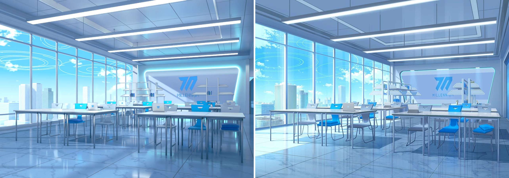

# ProceduralParadise

用 **Blender 几何节点（Geometry Nodes）+ Python/CLI** 以程序化、模块化的方式还原游戏世界。
所有几何体都由 GN 资产生成，所有布局、尺寸、配色、镜头都写在 JSON 数据里；场景可以在命令行
一键重建、渲染，也可以存成 `.blend` 在 Blender 里自由换机位。

当前内容：**Blue Archive / 千年科学学园（Millennium）社团活动室**（`BG_Milleniumclub`），
包括窗外的千年校区塔楼、基沃托斯城市与天空光环。



## 快速开始

需要 Blender 4.2+（或 PyPI 的 `bpy` 模块，已在 Blender 5.2 LTS / `bpy` 5.2 上验证）。

```bash
# Blender 可执行文件
blender -b -P BlueArchive/build.py -- Millennium/Rooms/ClubRoom --shot BG_Milleniumclub \
    --render out.png --samples 128 --save ClubRoom.blend

# 或者 bpy 模块
python BlueArchive/build.py Millennium/Rooms/ClubRoom --shot BG_Milleniumclub --render out.png

# 自由机位（在镜头文件 "views" 里定义）
python BlueArchive/build.py Millennium/Rooms/ClubRoom --shot BG_Milleniumclub --view reverse --render reverse.png

# 快速预览：半分辨率、少采样、不建城市/光环
python BlueArchive/build.py Millennium/Rooms/ClubRoom --shot BG_Milleniumclub --scale 0.5 --samples 32 --no-city --no-halo --render preview.png
```

描边（Freestyle）在无显示器的 Linux 上需要 EGL：安装 Mesa EGL 并设置 `EGL_PLATFORM=surfaceless`。

## 目录结构

```
Core/                     与游戏无关的通用框架
  nodes.py                节点树 DSL（运算符重载、版本兼容的节点解析）
  gn.py                   几何节点构建器 + 资产注册表（@asset）
  scene.py camera.py      场景/集合/GN 对象；摄影测量相机（焦距、主点偏移、两点透视）
  shaders.py render.py    程序化材质；Cycles、合成器外观（曝光、辉光、调色、Freestyle 描边）
  grade.py compare.py     调色拟合（直方图/色卡/回归）；与参考图的叠线、区域色差、SSIM 对比
BlueArchive/
  build.py                命令行入口：学院 → 校区 → 房间 → 镜头
  Kivotos/                整个基沃托斯共享：天空、太阳、光环、城市生成器
  Millennium/             千年科学学园
    Academy.json          学院设计系统（模数、层高、幕墙、色板）
    Kit/                  模块化 GN 资产库（建筑、家具、灯具、标识、材质）
    Campus/               校区总图 + 塔楼生成器（房间嵌在真实塔楼的真实立面里）
    rooms.py              由 room.json 装配房间
    Rooms/ClubRoom/       本次还原的社团活动室（room.json、镜头、参考图、渲染结果）
```

## 设计原则

* **没有"硬编码"几何**：每件东西都是带参数的 GN 资产，房间/校区只是数据。换一个房间只需要写一个
  新的 `room.json`，新学院复制 `Millennium/` 的结构并写自己的 `Academy.json`。
* **统一设计系统**：0.3 m 规划模数、1.2 m 地砖、1.5 m 幕墙模数、6.0 m 结构跨、5.4 m 层高。
  所有房间与塔楼共享这些数值，所以教室放进校区时立面、楼板、窗格天然对齐。
* **房间在塔楼里**：社团活动室位于 MIL-A 塔 24 层西立面；从房间里看出去的窗框就是塔楼本身的幕墙，
  窗外的楼、城市、光环都是世界坐标里的真实几何体，任何机位看到的都是同一个世界。
* **不用投影、不贴原图**：参考图只用于标定相机、测量尺寸和拟合颜色；渲染时从不采样参考图。
* **可验证**：`Core/compare.py` 生成几何叠线图（模型轮廓 vs 参考图边缘）、区域色差表和 SSIM，
  每次修改都用数字说话。
